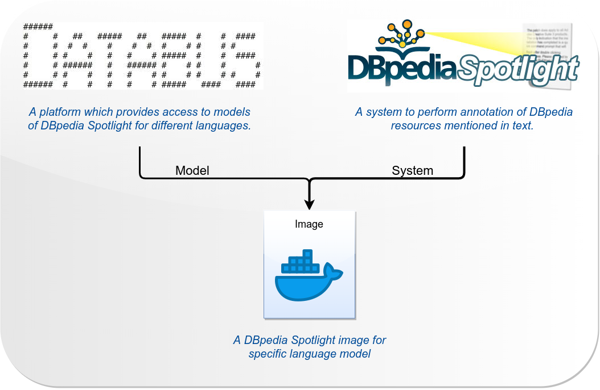
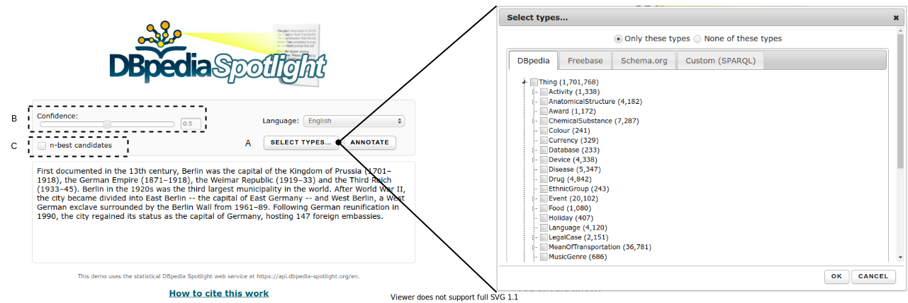

# DBpedia Spotlight Docker

**Table of contents**
- [What is DBpedia Spotlight](#what-is-dbpedia-spotlight)
- [Run DBpedia Spotlight as a single Docker container](#run-dbpedia-spotlight-as-a-single-docker-container)
    - [Setup Docker container](#setup-docker-container)
    - [Stop the Docker container](#stop-the-docker-container)
- [Run DBpedia Spotlight Multilingual](#run-dbpedia-spotlight-multilingual)
    - [Setup Docker Compose](#setup-docker-compose)
    - [Stop Docker Compose](#stop-docker-compose)
- [Supported Docker versions](#supported-docker-versions)
- [Documentation](#documentation)

# What is DBpedia Spotlight?

[DBpedia Spotlight](http://wikipedia.org/wiki/DBpedia#DBpedia_Spotlight) is a tool for automatically annotating mentions of DBpedia resources in text, providing a solution for linking unstructured information sources to the Linked Open Data cloud through DBpedia.

The dbpedia/spotlight-multilingual-databus is a docker image to run the DBpedia Spotlight server with the most recent language models, downloaded from the [DBpedia Databus repository](https://databus.dbpedia.org/dbpedia/spotlight/spotlight-model/) (as shown in Figure 1)., e.g., English (en), German (nl), Italian (it), etc. 

Figure 1. DBpedia Databus and DBpedia Spotlight

The following are the instructions to run a DBpedia Spotlight service for one or more language models and to deploy a web page to annotate text with any of the running services.

# Run DBpedia Spotlight as a single Docker container

## Setup Docker container

1. Create a volume to persist models 
    
        docker volume create spotlight-models

2. build docker image
    
        cd multilingual-databus
        docker build -t dbpedia/spotlight-multilingual-databus

3. Run docker image

        docker run -tid \
        --restart unless-stopped \
        --name dbpedia-spotlight.[LANG] \
        --mount source=spotlight-models,target=/opt/spotlight \
        -p 2222:80 \
        dbpedia/spotlight-multilingual-databus \
        spotlight.sh [LANG]      

  Where [LANG] is a two-digit code to define the language model to be run e.g., en, de, it.

4. Send a query to DBpedia Spotlight

        curl http://localhost:2222/rest/annotate \
        --data-urlencode "text=President Obama called Wednesday on Congress to extend a tax break for students included in last year's economic stimulus package, arguing that the policy provides more generous assistance." \
        --data "confidence=0.35" \
        -H "Accept: text/turtle"

 The "Accept: text/turtle" returns a NIF output but this option could be changed by "Accept: application/json" to returns a JSON output format.

To run more than one DBpedia Spotlight service, repeat the same step 3 changing the port number (`-p 222X:80`) and [LANG] e.g., `http://localhost:2222` for English ([LANG]=en) language and `http://localhost:2223` for German ([LANG]=de) language.

   - It is possible to monitor each DBpedia Spotlight service through docker tool such as:
    
       -   `docker logs dbpedia-spotlight.[LANG]` : Displays the log information for the corresponding service
       -  `docker stats dbpedia-spotlight.[LANG]`:  Shows the statistics (e.g., the amount of memory and CPU) for the corresponding service

## Stop the Docker container

An option to stop the DBpedia Spotlight server is by the commands:

     docker kill dbpedia-spotlight.[LANG]
     docker rm dbpedia-spotlight.[LANG]

The `docker kill` command will stop the running container and the `docker rm` command will remove the container. The `dbpedia-spotlight` corresponds to the name given with the `--name` option of the docker run command. 

# Run DBpedia Spotlight Multilingual

The DBpedia Spotlight Multilingual runs over a [web application](https://github.com/dbpedia-spotlight/demo) to provide a visual interface, annotating text for different languages. The interface provides features such as type selection (defined by DBpedia, Freebase, Schema or user defined, Figure 2-A), confidence value selection (from 0.0 to 1.0, Figure 2-B) and the n-best candidates (Figure 2-C). 

Figure 2. Example of DBpedia Spotlight web application 

The web application provides support for n-DBpedia Spotlight services, depending on the resource of the host machine (Figure 3-a). Each DBpedia Spotlight service is a docker container running in the same network (Figure 3-b), facilitating the communication between the web server and each DBpedia Spotlight service. The independency between each service helps to monitor the resources consumed by each one via docker stats or any monitor tool.

Figure 3. Example of DBpedia Spotlight Multilingual running in a Docker network over a web application 

## Setup Docker Compose

1. Create a new docker network (if it was not created before)

        docker network create spotlight-net

2. Create a volume to persist models (if it was not created before)

        docker volume create spotlight-models

3. Run Docker Compose file:

        cd multilingual-databus
        docker-compose -f spotlight-compose.yml up -d

   The Docker compose file (`spotlight-compose.yml`) defines one or more DBpedia Spotlight service through the following configuration block:

        spotlight.[LANG]:
        image: [DOCKER-IMAGE]
        container_name: dbepdia-spotlight.[LANG]
        volumes:
           - spotlight-model:/opt/spotlight
        restart: unless-stopped   
        ports:
           - "0.0.0.0:2224-2250:80"  
        networks:
           - spotlight-net          
        command: /bin/spotlight.sh [LANG]

 Where 

 - [LANG]: is a two digits code to define the language model e.g., en, de, it.
 - [DOCKER-IMAGE]: the name of the docker image.

    The `sites.xml` file defines the models available on the web application (`<text> .... </text>` tag is optional, it is used to provide an example text), at this moment it is updated by the user based on their necessities (the number of services run)
 

        <site>
                <i18n>[LANG]</i18n>
                <language>German</language>
                <url>http://[IP]:2222/[LANG]/rest</url>
                <text>Erstmals 1237 urkundlich erwähnt, war Berlin im Verlauf der Geschichte und in verschiedenen Staatsformen Hauptstadt Brandenburgs, Preußens und des Deutschen Reichs. Faktisch war der Ostteil der Stadt Hauptstadt der Deutschen Demokratischen Republik. Seit der Wiedervereinigung im Jahr 1990 ist Berlin gesamtdeutsche Hauptstadt mit Sitz des Bundespräsidenten seit 1994, des Deutschen Bundestags seit 1999 sowie des Bundesrats seit 2000.</text>
        </site>

 Where:
    
 - `<i18n>`: it is the same two digits code as [LANG] e.g., en, de, it.
 - `<language>`: it is a label to denotes the language to be used e.g.,  English, German, Italian, etc.
 - `<url>`:  by default, the web application runs over the 2222 port but, this could be changed in the compose file. [LANG] defines the language model to be queried.
 - `[IP]`: Defines the IP address of the host machine or it could be set as `localhost` or `0.0.0.0`

 The `sites.xml` file is copied to the web application docker image through the directive:

        ....
        volumes:
           - [PATH_TO_FILE]/sites.xml:/var/www/html/config/sites.xml 
        ...

4. Run Docker Compose file

        docker-compose -f spotlight-compose.yml up -d

5. In a web browser access to http://localhost:2222/

6. To query via curl

        curl http://localhost:2222/[LANG]/annotate \
        --data-urlencode "text=President Obama called Wednesday on Congress to extend a tax break for students included in last year's economic stimulus package, arguing that the policy provides more generous assistance." \
        --data "confidence=0.35" \
        -H "Accept: text/turtle"

## Stop Docker Compose

An option to stop the DBpedia Spotlight server is by the commands:

    docker-compose -f spotlight-compose.yml stop
   
The `stop` command will stop the running containers. The `spotlight-compose.yml` corresponds to the file name used to run the compose file. 

## Supported Docker versions
This image is officially supported on Docker version **`19.03.11`**.

Please see the [Docker installation documentation](https://docs.docker.com/installation/) for details on how to upgrade your Docker daemon.

## Documentation

Documentation for this image is stored in [GitHub repo](http://github.com/dbpedia-spotlight/dbpedia-spotlight/wiki).

